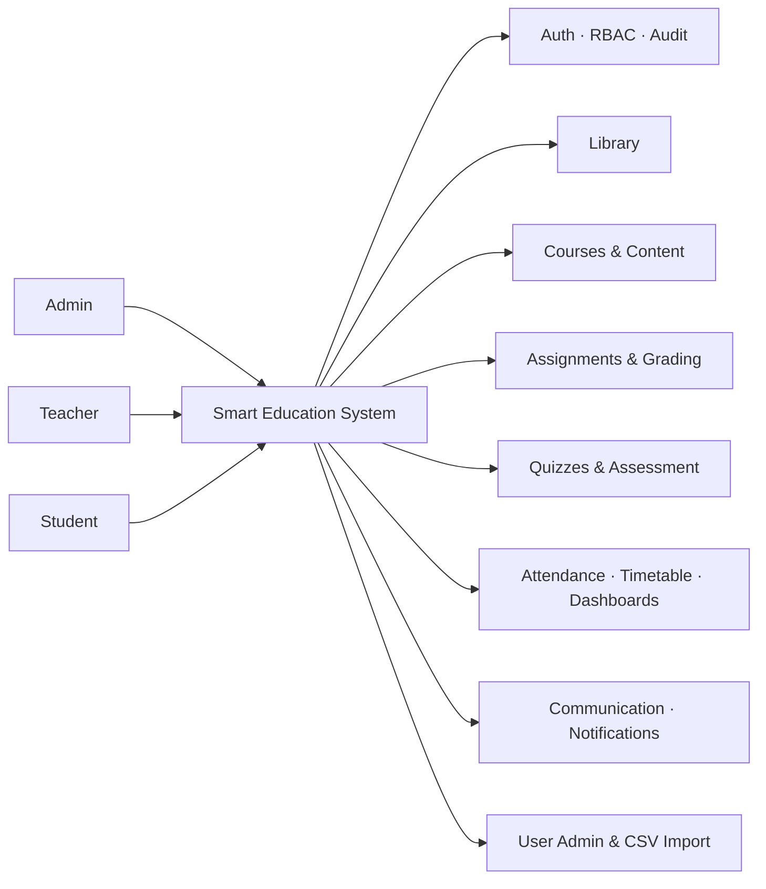
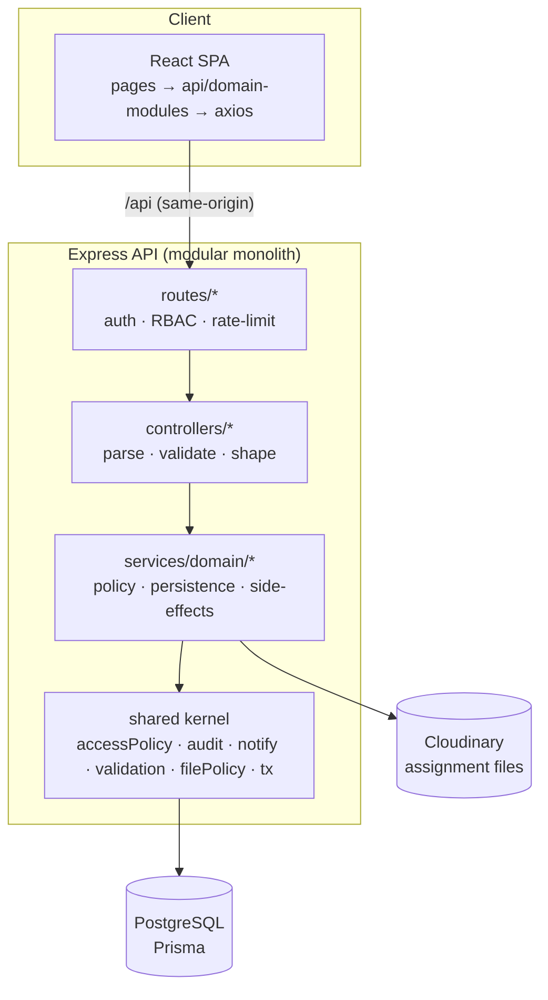
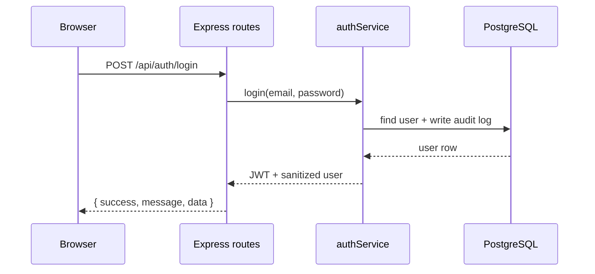
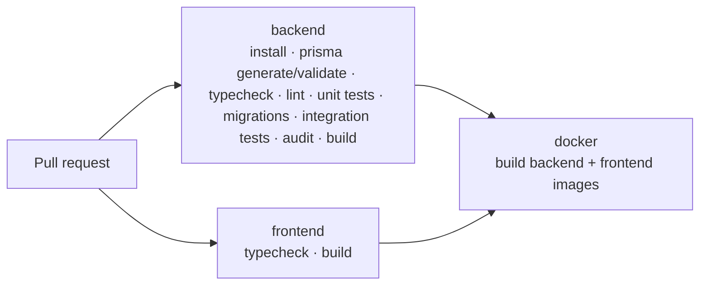

<div align="center">

# 🎓 Smart Education System

**A pilot-ready full-stack platform for Ethiopian high schools** — a modular monolith for daily school operations: learning, records, and communication in one place.

[](https://github.com/Gammee10/SmartEducation/actions/workflows/ci.yml)
[](https://nodejs.org)
[](https://www.typescriptlang.org)
[](https://react.dev)
[](https://vitejs.dev)
[](https://tailwindcss.com)
[](https://expressjs.com)
[](https://www.prisma.io)
[](https://www.postgresql.org)
[](#testing)
[](#license)

</div>

---

## Table of Contents

- [Overview](#overview)
- [Tech Stack](#tech-stack)
- [Quick Start](#quick-start)
- [Demo Accounts](#demo-accounts)
- [Feature Modules](#feature-modules)
- [Architecture](#architecture)
- [Project Structure](#project-structure)
- [API Reference](#api-reference)
- [Environment Variables](#environment-variables)
- [Testing & CI](#testing--ci)
- [Security Model](#security-model)
- [Deployment](#deployment)
- [Documentation](#documentation)
- [Contributing](#contributing)
- [License](#license)

---

## Overview

Smart Education System is a digital platform for a single school (pilot) covering six operational areas: **identity & library**, **LMS courses & content**, **assignments & grading**, **quizzes & assessment**, **attendance, timetable & dashboards**, and **communication, notifications & user administration**.



**Design principles**

- **Modular monolith** — one deployable backend with clear domain boundaries, not microservices.
- **Server is the sole enforcer** — RBAC, ownership, quiz timing/secrecy, audience filtering, and file policy are all enforced in the API; the UI only mirrors them for affordance.
- **History is preserved** — soft-delete/archival and `Restrict` foreign keys protect academic records (grades, attendance, attempts, loans).
- **Auditable by default** — sensitive writes (grading, corrections, approvals, archival, logins) are written to an audit log, typically inside the same transaction.

---

## Tech Stack

| Layer | Choice | Why |
|---|---|---|
| Frontend | **React 18 + Vite 5 + Tailwind 3** | Fast dev server, utility-first styling, small bundle |
| Routing / data | **React Router 6** + a per-domain `api/` layer on **axios** | Contract isolation from backend routes |
| Backend | **Node.js 20+ + Express 4 (TypeScript)** | Familiar, explicit, easy to reason about |
| Database | **PostgreSQL 16 via Prisma 5** | Typed queries, migrations, `Restrict` FKs |
| DB hosting | **Supabase** (pooler for app, direct for migrations) | Managed Postgres with connection pooling |
| File storage | **Cloudinary** | Assignment submission files only (content upload is URL-based) |
| Auth | **JWT (HS256) + bcrypt**, `tokenVersion` revocation | Stateless session with server-side kill switch |
| Notifications | **In-app only** (polling bell) | No push/SMTP/Redis infra for the pilot |
| CI | **GitHub Actions** | Backend tests + integration + audit, frontend build, Docker images |

---

## Quick Start

> **Prerequisites:** [Node.js](https://nodejs.org) **>= 20** and a PostgreSQL database ([Supabase](https://supabase.com) free tier works).

<details open>
<summary><b>1 · Clone & install</b></summary>

```bash
git clone https://github.com/Gammee10/SmartEducation.git
cd SmartEducation
npm install          # installs both backend and frontend workspaces
```
</details>

<details open>
<summary><b>2 · Configure environment</b></summary>

```bash
cd backend
cp .env.example .env
# then edit backend/.env (see Environment Variables below)
```

Minimum for local dev: `DATABASE_URL`, `DIRECT_URL`, `JWT_SECRET`. Cloudinary and a private `DEFAULT_USER_PASSWORD` are needed for uploads and production.
</details>

<details open>
<summary><b>3 · Create the schema & seed demo data</b></summary>

```bash
npm run prisma:migrate     # apply migrations
npm run prisma:seed        # demo admin/teacher/student + sample library books
```
</details>

<details open>
<summary><b>4 · Run it</b></summary>

```bash
# Terminal 1 — API  → http://localhost:5000
npm run dev:backend

# Terminal 2 — SPA  → http://localhost:5173
npm run dev:frontend
```

Open **http://localhost:5173** and log in. The Vite dev server proxies `/api` to `localhost:5000` (override with `VITE_API_PROXY`).
</details>

<details>
<summary><b>Root scripts cheat-sheet</b></summary>

| Command | Purpose |
|---|---|
| `npm run dev:backend` / `dev:frontend` | Start each app in watch mode |
| `npm run build` | Type-check + build backend and frontend |
| `npm run typecheck` | Type-check both workspaces |
| `npm run lint` | ESLint over `backend/src` and `frontend/src` |
| `npm run test:backend` | Backend unit tests (Node test runner) |
| `npm run prisma:generate` / `migrate` / `seed` | Prisma helpers |
</details>

---

## Demo Accounts

Seeded by `npm run prisma:seed` (dev only). The password is `SEED_PASSWORD` if set, otherwise a dev-only default — **set `SEED_PASSWORD` and rotate these accounts in any shared environment**.

| Role | Email | Can do |
|---|---|---|
| 🛡️ Admin | `admin@school.edu` | Manage library, enroll students, manage users, view everything |
| 👩‍🏫 Teacher | `teacher@school.edu` | Create courses/content, assign & grade, build quizzes, mark attendance |
| 🧑‍🎓 Student | `student@school.edu` | Browse courses, submit work, take quizzes, borrow books |

---

## Feature Modules

<details open>
<summary>🔐 <b>Identity, RBAC & Library</b></summary>

- JWT login with bcrypt password hashing; `tokenVersion` revokes sessions on password change/reset/archive.
- Role-based access control (Admin / Teacher / Student) enforced server-side; **no public registration**.
- Full audit logging for sensitive actions (including login success/failure).
- Book catalog with search; copy-level tracking (available / borrowed / damaged / lost).
- Student borrow requests → admin approval → loan with due date → return with condition; atomic copy claim prevents double-loans.
</details>

<details open>
<summary>📚 <b>LMS Courses & Content</b></summary>

- Teachers create courses (subject, grade level, status); admins enroll/unenroll students.
- Content items (video / document / PDF / image / link) with URL validation (`http(s)` only).
- Students see only their active, enrolled courses; teacher/admin roster visibility differs for privacy.
- Course-scoped assignments, quizzes, and attendance live under `/api/courses/:id/...`.
</details>

<details open>
<summary>📝 <b>Assignments & Grading</b></summary>

- Teachers create assignments with instructions, max score, and due date; lowering max score below an awarded score is blocked.
- Students submit text and/or a file (documents/images/archives, **20 MB** max) stored on Cloudinary; late submissions are flagged.
- Teachers grade with score + feedback; grading, audit, and the student notification happen in one transaction.
- Failed DB writes after a successful upload compensate by deleting the orphaned Cloudinary asset.
</details>

<details open>
<summary>🧠 <b>Quizzes & Assessment</b></summary>

- Teacher-built quizzes with single/multiple-choice questions, point values, time limits, max attempts, and shuffle options.
- **Server-side timing** — attempts auto-expire; **attempt limits** enforced; in-progress attempts resume without resetting the timer.
- **Auto-grading** with exact-set matching; foreign/forged option ids are dropped and duplicates deduplicated.
- Correct answers are **never sent** to students before submission; quiz content is frozen once published or attempted.
- Results trigger `QUIZ_RESULT` notifications.
</details>

<details open>
<summary>📊 <b>SIS — Attendance, Timetable & Dashboards</b></summary>

- Bulk attendance per course/day (Present / Absent / Late / Excused); corrections are audited with before/after snapshots.
- Students see only their own attendance; teachers only their own courses.
- Weekly timetable with **room & teacher conflict detection** (advisory-lock serialized).
- Role dashboards: admin (school-wide counts, attendance rate, averages), teacher (courses + recent activity), student (enrollment, rates, scores), plus a student profile page.
</details>

<details open>
<summary>💬 <b>Communication, Notifications & User Admin</b></summary>

- Announcements & events with audience targeting (Everyone / Teachers / Students), filtered **server-side**.
- Publishing fans out in-app notifications (chunked) atomically with the post.
- Notification bell with unread badge + inbox (unread filter, mark one/all read; owner-only).
- Admin user management with auto-generated `STU-####` / `TCH-####` codes, archive (soft delete), and password reset.
- **CSV bulk import** with per-row validation, bounded concurrency, and `ImportBatch` / `ImportError` tracking.
</details>

---

## Architecture



**Layering rule:** `routes → controllers → services → shared kernel → prisma`. Services never import another service's internals; cross-domain policy (course access, audit, notifications, validation, file rules) lives in the shared kernel. See [`docs/REFACTORING_PLAN.md`](docs/REFACTORING_PLAN.md) for the architecture hardening work and its status.

<details>
<summary><b>Request lifecycle (example: login)</b></summary>


</details>

<details>
<summary><b>Data model (25 Prisma models)</b></summary>

Users & profiles, academic structure (courses, enrollments, content), assessment (assignments, submissions, quizzes, questions, options, attempts, answers), school operations (attendance, timetable, announcements, events), and platform records (notifications, audit logs, import batches/errors, library books/copies/requests/loans).

Schema source of truth: [`backend/prisma/schema.prisma`](backend/prisma/schema.prisma).
</details>

---

## Project Structure

```text
SmartEducation/
├── backend/                         # Express API (TypeScript)
│   ├── prisma/
│   │   ├── schema.prisma            # 25 models — database source of truth
│   │   └── seed.ts                  # demo users + sample data
│   ├── src/
│   │   ├── shared/                  # kernel: accessPolicy, audit, notify, validation, filePolicy, tx
│   │   ├── services/                # domain logic; leaf modules + thin barrels
│   │   │   ├── courses/  assignments/  quizzes/  library/  users/
│   │   │   └── auth/ notification/ attendance/ timetable/ communication/ dashboard …
│   │   ├── controllers/             # HTTP layer (parse / validate / shape)
│   │   ├── routes/                  # route wiring + role gates + multer config
│   │   ├── middleware/              # auth, RBAC, rate limits, error handler
│   │   ├── utils/                   # response envelope, errors, pagination, logger
│   │   ├── config/                  # env validation
│   │   ├── app.ts  index.ts
│   │   └── prisma/client.ts         # single shared PrismaClient
│   └── tests/                       # unit tests + tests/integration (real Postgres)
├── frontend/                        # React SPA (TypeScript + Vite + Tailwind)
│   └── src/
│       ├── api/                     # per-domain API modules + envelope helper
│       ├── components/              # Layout, ui design system, guards
│       ├── context/                 # AuthContext
│       ├── hooks/                   # useApi, useTheme, usePageTitle
│       ├── pages/                   # one file per screen
│       ├── types/                   # shared TypeScript types
│       └── utils/                   # apiError, safeUrl, notificationBus
├── docs/                            # architecture, plans, handoff packages
└── .github/workflows/ci.yml         # backend · frontend · docker jobs
```

---

## API Reference

All responses share one envelope (paginated endpoints add a `pagination` sibling):

```json
{ "success": true, "message": "Operation completed successfully", "data": {} }
```

<details>
<summary><b>🔐 Auth</b></summary>

| Method | Endpoint | Description | Access |
|---|---|---|---|
| POST | `/api/auth/login` | Login, returns JWT | Public |
| GET | `/api/auth/me` | Current user | Auth |
| PUT | `/api/auth/password` | Change own password (revokes sessions) | Auth |
</details>

<details>
<summary><b>📚 Library</b></summary>

| Method | Endpoint | Description | Access |
|---|---|---|---|
| GET | `/api/library/books` | List / search books | Auth |
| GET | `/api/library/books/:id` | Book detail | Auth |
| POST | `/api/library/books` | Create book | Admin |
| PUT | `/api/library/books/:id` | Update book | Admin |
| POST | `/api/library/books/:id/copies` | Add copies | Admin |
| POST | `/api/library/requests` | Submit borrow request | Student |
| GET | `/api/library/requests/mine` | My requests | Student |
| GET | `/api/library/requests` | All requests | Admin |
| POST | `/api/library/requests/:id/decide` | Approve / reject | Admin |
| GET | `/api/library/loans/mine` | My loans | Student |
| GET | `/api/library/loans` | All loans | Admin |
| POST | `/api/library/loans/:id/return` | Record return (+ condition) | Admin |
</details>

<details>
<summary><b>📖 Courses & Content</b></summary>

| Method | Endpoint | Description | Access |
|---|---|---|---|
| GET | `/api/courses` | List courses | Auth |
| GET | `/api/courses/:id` | Course detail | Auth |
| POST | `/api/courses` | Create course | Teacher |
| PUT | `/api/courses/:id` | Update course | Teacher / Admin |
| POST | `/api/courses/:id/enroll` | Enroll student | Admin |
| POST | `/api/courses/:id/unenroll` | Unenroll student | Admin |
| GET | `/api/courses/:id/content` | List content | Auth |
| POST | `/api/courses/:courseId/content` | Upload content (URL) | Teacher |
| POST | `/api/courses/content/:id/archive` | Archive content | Teacher / Admin |
</details>

<details>
<summary><b>📝 Assignments</b></summary>

| Method | Endpoint | Description | Access |
|---|---|---|---|
| GET | `/api/courses/:id/assignments` | List course assignments | Auth |
| POST | `/api/courses/:id/assignments` | Create assignment | Teacher |
| GET | `/api/assignments/:id` | Assignment detail | Auth |
| PUT | `/api/assignments/:id` | Update assignment | Teacher / Admin |
| POST | `/api/assignments/:id/archive` | Archive assignment | Teacher / Admin |
| POST | `/api/assignments/:id/submit` | Submit work (text/file) | Student |
| GET | `/api/assignments/:id/submissions` | List submissions | Teacher / Admin |
| POST | `/api/submissions/:id/grade` | Grade submission | Teacher / Admin |
</details>

<details>
<summary><b>🧠 Quizzes</b></summary>

| Method | Endpoint | Description | Access |
|---|---|---|---|
| GET | `/api/courses/:id/quizzes` | List course quizzes | Auth |
| POST | `/api/courses/:id/quizzes` | Create quiz | Teacher |
| GET | `/api/quizzes/:id` | Quiz detail (answers hidden from students) | Auth |
| PUT | `/api/quizzes/:id` | Update quiz | Teacher / Admin |
| POST | `/api/quizzes/:id/archive` | Archive quiz | Teacher / Admin |
| POST | `/api/quizzes/:id/questions` | Add question | Teacher / Admin |
| PUT | `/api/quizzes/questions/:questionId` | Update question | Teacher / Admin |
| DELETE | `/api/quizzes/questions/:questionId` | Delete question | Teacher / Admin |
| POST | `/api/quizzes/:id/attempt` | Start / resume attempt | Student |
| POST | `/api/attempts/:id/submit` | Submit & auto-grade | Student |
| GET | `/api/attempts/:id` | Attempt detail | Auth (owner / staff) |
| GET | `/api/quizzes/:id/results` | Quiz results | Auth (owner / staff) |
</details>

<details>
<summary><b>📊 Attendance, Timetable & Dashboards</b></summary>

| Method | Endpoint | Description | Access |
|---|---|---|---|
| GET | `/api/courses/:id/attendance` | Course attendance by date | Auth (role-filtered) |
| POST | `/api/attendance/upsert` | Mark attendance (bulk/single) | Teacher |
| PUT | `/api/attendance/:id` | Correct a record (audited) | Teacher / Admin |
| GET | `/api/students/:id/attendance` | Student attendance history | Self / Teacher / Admin |
| GET | `/api/timetable` | Weekly timetable slots | Auth (role-filtered) |
| POST | `/api/timetable` | Create slot (conflict-checked) | Admin |
| PUT | `/api/timetable/:id` | Update slot | Admin |
| DELETE | `/api/timetable/:id` | Delete slot | Admin |
| GET | `/api/dashboard/admin` | School-wide stats | Admin |
| GET | `/api/dashboard/teacher` | Teacher stats & activity | Teacher |
| GET | `/api/dashboard/student` | Student stats & courses | Student |
| GET | `/api/students/:id/summary` | Academic profile summary | Self / Teacher / Admin |
</details>

<details>
<summary><b>💬 Communication, Notifications & User Admin</b></summary>

| Method | Endpoint | Description | Access |
|---|---|---|---|
| GET | `/api/announcements` | List announcements (audience-filtered) | Auth |
| POST | `/api/announcements` | Publish (+ notify audience) | Teacher / Admin |
| DELETE | `/api/announcements/:id` | Delete announcement | Admin / owner |
| GET | `/api/events` | List events (audience-filtered) | Auth |
| POST | `/api/events` | Create event (+ notify audience) | Teacher / Admin |
| DELETE | `/api/events/:id` | Delete event | Admin / owner |
| GET | `/api/notifications` | My notifications (`unreadOnly`, paged) | Auth |
| GET | `/api/notifications/unread-count` | Unread count for bell | Auth |
| PUT | `/api/notifications/:id/read` | Mark one read (owner only) | Auth |
| PUT | `/api/notifications/read-all` | Mark all read | Auth |
| GET | `/api/users` | List / filter / search users | Admin |
| POST | `/api/users` | Create user | Admin |
| PUT | `/api/users/:id` | Update user details / status | Admin |
| POST | `/api/users/:id/archive` | Archive user (soft delete) | Admin |
| POST | `/api/users/:id/reset-password` | Generate temporary password | Admin |
| POST | `/api/users/import` | CSV bulk import (JSON `{ csv, filename }`) | Admin |
</details>

<details>
<summary><b>🩺 Health</b></summary>

| Method | Endpoint | Description |
|---|---|---|
| GET | `/api/health` | Service health check |
</details>

---

## Environment Variables

Configured in `backend/.env` (copy from [`backend/.env.example`](backend/.env.example)); **never commit `.env`**.

| Variable | Required | Notes |
|---|---|---|
| `DATABASE_URL` | Prod | App queries via the **pooler** (e.g. Supabase port 6543) |
| `DIRECT_URL` | Prod | Migrations/seed use the **direct** connection (port 5432) |
| `JWT_SECRET` | Prod | Required in production; long random value |
| `JWT_EXPIRES_IN` | No | Defaults to `12h` |
| `CLIENT_URLS` | Prod | Comma-separated allowed origins (must be `https://` in prod) |
| `TRUST_PROXY` | Prod | Number of proxy hops; set `1` on Render/Fly/Railway |
| `DEFAULT_USER_PASSWORD` | Prod | Initial password for admin-created/imported users |
| `SEED_PASSWORD` | No | Dev seed account password (dev-only default otherwise) |
| `CLOUDINARY_CLOUD_NAME` / `_API_KEY` / `_API_SECRET` | Uploads | Required for assignment file uploads |
| `PORT` | No | API port (default `5000`) |
| `NODE_ENV` | No | `development` / `production` (prod fail-fast checks) |
| `LOG_LEVEL` / `SENTRY_DSN` | No | Log verbosity; optional error tracker hook |

---

## Testing & CI

```bash
npm run test:backend                                   # 268 unit tests (mocked Prisma)
npm run test:integration --workspace backend           # needs TEST_DATABASE_URL
npm run typecheck && npm run lint && npm run build
```

<details>
<summary><b>What the 268 backend tests cover</b></summary>

- Response/error helpers, pagination, RBAC middleware, logger redaction
- Auth: login, sanitization, password change, `tokenVersion` revocation, 72-byte guard
- Audit payloads; library catalog/requests/approvals/loans/returns (incl. race guards)
- Courses, enrollment, content; assignments submission/grading (incl. Cloudinary compensation)
- Quizzes: answer secrecy, attempt limits, expiry, exact-set scoring, content freeze
- Attendance marking/corrections with before/after audit; timetable conflict detection
- Dashboards, announcements/events audience filtering + fan-out, notification ownership
- User admin: validation, archive guards, CSV per-row errors
- Refactoring characterization/contract tests (envelope shape, access matrix, scoring)
</details>

**CI** ([`.github/workflows/ci.yml`](.github/workflows/ci.yml)) runs three jobs on every PR:



> Integration tests run against a real PostgreSQL service in CI; the security audit gate fails on **high** severity.

---

## Security Model

- 🔒 No public registration — admin-controlled user creation only.
- 🔑 bcrypt password hashing; 72-byte guard; passwords never logged or returned.
- 🎫 JWT (HS256) on every protected route, with server-side `tokenVersion` revocation.
- 👮 RBAC **and** ownership checks in the service layer — the UI is never trusted.
- 🕵️ Quiz correct answers never leave the server before submission; timing/limits server-enforced.
- 🗂️ Sensitive write actions are audited (often in the same transaction).
- 🧾 Historical records are never hard-deleted (soft-delete/archival + `Restrict` FKs).
- 🧱 Upload hardening: MIME allowlist + magic-byte sniffing + active-markup scan + size cap.
- 🚦 Layered rate limits (api / auth / authenticated / sensitive / upload).
- ⚙️ Production fail-fast on missing `JWT_SECRET`, `DEFAULT_USER_PASSWORD`, `DATABASE_URL`, or insecure CORS/`TRUST_PROXY`.

---

## Deployment

Both apps ship as Docker images (see `backend/Dockerfile`, `frontend/Dockerfile`):

```bash
docker build -f backend/Dockerfile -t smartedu-backend .
docker build -f frontend/Dockerfile -t smartedu-frontend .
```

- **Backend image** — Node 20 slim; generates the Prisma client, builds `dist`, prunes dev deps, applies migrations on boot, then starts the API.
- **Frontend image** — Vite build served by nginx; `/api/` is reverse-proxied to the `backend` host (same-origin, so no CORS in production).

Set the environment variables above on your host (Supabase for the database, a value for `TRUST_PROXY` behind a proxy).

---

## Documentation

| Document | Description |
|---|---|
| [`docs/FINAL_ARCHITECTURE.md`](docs/FINAL_ARCHITECTURE.md) | System architecture & design decisions |
| [`docs/IMPLEMENTATION_PLAN.md`](docs/IMPLEMENTATION_PLAN.md) | Implementation phases & exit criteria |
| [`docs/REFACTORING_PLAN.md`](docs/REFACTORING_PLAN.md) | Architectural hardening plan + implementation status |
| [`docs/DEVELOPMENT_HANDOFF_PACKAGE.md`](docs/DEVELOPMENT_HANDOFF_PACKAGE.md) | Team handoff overview |
| [`docs/handoff/`](docs/handoff/) | Per-member handoff packages |
| [`docs/AGENTS.md`](docs/AGENTS.md) | Repository conventions for AI agents |
| [`TEAM_WORK_ORDER.md`](TEAM_WORK_ORDER.md) | Merge order & team coordination |

---

## Contributing

This project is built by a team of six using **feature-based ownership** — each member works on a branch and merges via pull requests in a defined order.

1. Create a feature branch (`git checkout -b feature/your-feature`)
2. Make scoped changes; keep the public API and envelope stable
3. Run `npm run typecheck && npm run lint && npm run test:backend`
4. Push and open a Pull Request

> ⚠️ Merge order matters — see [`TEAM_WORK_ORDER.md`](TEAM_WORK_ORDER.md).

---

## License

For educational use. Built with ❤️ for Ethiopian high schools.
